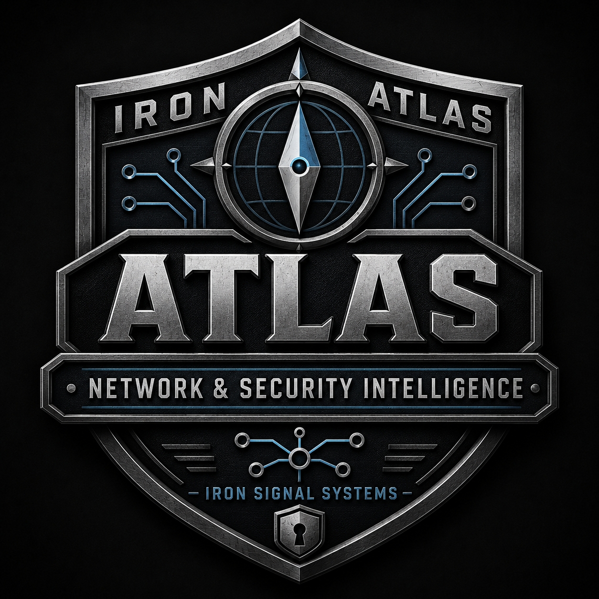

# Atlas

<p align="center">
  
</p>

> An Iron Signal Systems project
>
> Built on purpose. Backed by discipline. Engineered to endure.
>
> Development status: Phase 1 Step 2 is accepted; Phase 1 Step 3 authentication assurance and provider-neutral assurance evidence are merged non-production implementation checkpoints; the representative-provider evidence foundation is active from signed boundary `e7824049852855f15d26686600fc42802b8a38ff`; representative-provider compatibility remains future evidence-backed work; infrastructure ingestion and intelligence capabilities remain under active development; not ready for production use
> Repository assurance: Published ISRAS 0.1.8 is formally adopted at the exact signed and evidence-bound acceptance boundary. The merged but unaccepted 0.1.4 candidate and previously recorded 1.0.1 boundary remain historical.
> Repository license: Business Source License 1.1 (`BUSL-1.1`); non-production use is permitted, while production use before the applicable change event requires a separate commercial license.

## Product Vision

**Atlas is an evidence-driven network and security intelligence platform built to give Network Operations Teams, Security Operations Teams, operational leaders, and change authorities fast, defensible answers about the environment.**

Atlas ingests configuration, operational, diagnostic, monitoring, logging, security, and documentation evidence from infrastructure and supporting systems. It correlates that evidence across vendors and technologies to explain infrastructure identity, topology, VLANs, subnets, CIDRs, routing, reachability, security controls, exposure, dependencies, risk, and change impact without forcing users to reconstruct the answer across dozens of interfaces.

> **Do not make the user browse the network. Reconstruct the network and answer the question.**

Atlas is not primarily a configuration browser, parser collection, monitoring replacement, or automated network controller. Vendor adapters and collectors are evidence sources. The product is the correlated, evidence-backed answer produced from them.

## Questions Atlas Must Answer

Atlas is intended to answer questions such as:

- Where does this IP address, CIDR, subnet, VLAN, interface, device, route, policy, or service exist?
- Which subnet contains an address, and which prefix is the longest-prefix match?
- Which VLAN, switch port, trunk, SVI, gateway, VDOM, VRF, routing domain, zone, and device participate?
- Which route wins, why does it win, and what alternate or failed paths exist?
- Can source A reach destination B using protocol or port X?
- Which firewall policies, ACLs, NAT rules, VIPs, VPNs, SD-WAN rules, schedules, identities, and security profiles affect that path?
- Which networks overlap, conflict, shadow one another, or appear broader than intended?
- Which trust boundaries and attack paths exist across network controls and identity privilege relationships?
- What depends on a device, interface, route, VLAN, policy, tunnel, or circuit?
- What changed from the prior accepted state?
- What will a proposed change affect, what is the blast radius, and what happens if the change is denied or delayed?
- Which exact evidence supports the answer, and what remains unknown, inferred, stale, incomplete, or conflicting?

## First Major Evidence Sources

The first two major infrastructure-ingestion workstreams are:

### Cisco

Cisco configuration and operational evidence supplies switching, routing, wireless, endpoint-attachment, topology, and device-health context, including:

- devices, stacks, software, licenses, and hardware;
- interfaces, descriptions, state, errors, and counters;
- VLANs, voice VLANs, access ports, trunks, native VLANs, allowed VLANs, active VLANs, and pruning;
- SVIs, routed interfaces, routes, first-hop redundancy, and routing domains;
- CDP, LLDP, MAC, ARP, port channels, and spanning tree;
- ACL and management-plane context;
- Catalyst 9800 controllers, APs, WLANs, profiles, sites, flex profiles, and tags; and
- running configuration, technical-support output, and targeted diagnostics.

### FortiGate

FortiGate configuration and operational evidence supplies security-policy, routing, translation, VPN, SD-WAN, and trust-boundary context, including:

- interfaces, VLANs, zones, VDOMs, and routing domains;
- addresses, groups, services, schedules, users, and profiles;
- firewall policies and evaluation order;
- connected, static, dynamic, default, and policy routes;
- source NAT, destination NAT, VIPs, pools, and port translation;
- VPN definitions, selectors, routes, interfaces, and live state;
- SD-WAN zones, members, rules, health checks, and member selection;
- local-in and management exposure;
- HA, interface, route, session, VPN, and diagnostic state; and
- configuration and runtime disagreement.

Cisco and FortiGate adapters may progress independently, but neither adapter is the product by itself. Their evidence converges into the canonical network and security model and the answer engine.

## Product Position

Atlas complements established operational systems instead of recreating capabilities they already perform well.

- Zabbix remains responsible for continuous monitoring, alerting, graphing, escalation, maintenance, and availability history.
- Graylog remains responsible for centralized log and SNMP-trap collection, indexing, retention, search, and investigation.
- Security Onion and other security platforms remain responsible for packet analysis, detection, and investigation.
- BloodHound remains responsible for identity and privilege attack-graph analysis; SharpHound remains an approved collector for BloodHound-compatible Active Directory evidence. Atlas correlates identity paths with network reachability, exposure, dependencies, and change impact.
- Cisco, Fortinet, and other infrastructure systems remain responsible for operation and enforcement.
- Draw.io remains a supported human-editable diagram source and publication format.

Atlas contributes authoritative evidence lineage, normalized infrastructure identity, topology, reconciliation, reachability explanation, attack-path context, change impact, decision support, validation, and permanent acceptance history.

The default operating mode is read, ingest, normalize, correlate, calculate, explain, compare, recommend, export, or validate. Any future write or provisioning capability requires a separately accepted, least-privileged, previewable, attributable, bounded, approval-aware, reversible where practical, and validated boundary.

## Current Executable Boundary

The accepted Phase 0 baseline contains an embedded HTML5 interface, module registry, memory-backed change workflow, initial vendor parsers, a native Go Zabbix sender adapter, and repository validation.

Accepted Phase 1 Steps 1 and 2 add governed PostgreSQL migrations, durable identity and authority records, database-enforced independent approval, append-only history, a least-privileged Go PostgreSQL runtime, transaction-local actor context, persistent change creation and approval, failure isolation, and readiness behavior.

Phase 1 Step 3 trusted-authentication work remains incomplete and non-production. The merged provider-neutral assurance-evidence checkpoint uses only Atlas-controlled synthetic claims, rejects `acr` or `amr` without explicit `auth_time`, and requires exact governed method sets. The active representative-provider evidence foundation adds strict observation-only sanitized bundles, digest and path binding, literal claim preservation, and secret rejection without asserting compatibility. Atlas does not store local user passwords or TOTP seeds and is not intended to become a local credential or MFA provider. Representative-provider compatibility remains future evidence-backed work; completed session lifecycle, logout and administrative revocation, CSRF, trusted proxies, production wiring, and formal acceptance remain incomplete. Infrastructure evidence ingestion, normalization, correlation, query, and reporting capabilities are active development work and must not be represented as production-complete.

FortiGate YAML snapshot ingestion is an active, self-validated,
non-production evidence-adapter candidate. The current checkpoint processes a
private 13.2 MB FortiOS 7.2.13 YAML export using bounded maintained YAML
decoding, native-layout detection, vendor-independent normalization, semantic
reference analysis, and aggregate-only privacy-safe reporting. It produced
2,923 normalized records and classified 10,287 references while retaining
1,597 unresolved references and 263 unrecognized root entries as explicit
coverage gaps. This proves a bounded ingestion foundation, not complete
FortiGate understanding, cross-vendor correlation, reachability analysis, or
production readiness.

## Quick Start

```bash
go test ./...
go run ./cmd/atlasd
```

Open `http://127.0.0.1:8080`.

Development identity mechanisms are for controlled local testing only and are never an acceptable production authentication boundary.

## Repository Layout

```text
.
├── cmd/                     Go executables
├── configs/                 Non-secret configuration examples
├── deployment/              Arch Linux and systemd material
├── diagrams/                Draw.io sources and publication boundary
├── docs/                    Normative architecture and project documentation
├── integrations/            Replaceable external-system adapters
├── internal/                Shared application and PostgreSQL runtime implementation
├── modules/                 Vendor and capability modules
├── projects/                Project-governance templates and records
├── changes/                 Change-management templates and records
├── sql/                     Governed PostgreSQL schema and migration manifest
├── test-framework/          Test orchestration and transient local results
├── validation/              Toolchain contract and committed sanitized evidence
└── tools/validation/        Repository checks, evidence tools, and phase gates
```

## Validation

```bash
python3 tools/validation/validate_toolchain.py
./test-framework/run_all.sh
```

Formal acceptance additionally requires the exact pushed commit to pass applicable validation from a clean clone of the canonical GitHub repository. Retained validation evidence must be sanitized before it enters Git.

## Documentation

Start with:

- [Documentation index](docs/README.md)
- [Project mission](docs/goals/PROJECT-MISSION.md)
- [Product vision and operating mindset](docs/goals/PRODUCT-VISION-AND-OPERATING-MINDSET.md)
- [Target architecture](docs/architecture/TARGET-ARCHITECTURE.md)
- [Query, reachability, and change-impact model](docs/architecture/QUERY-REACHABILITY-AND-CHANGE-IMPACT-MODEL.md)
- [FortiGate YAML snapshot prototype](docs/architecture/FORTIGATE-YAML-SNAPSHOT-PROTOTYPE.md)
- [ADR-0007 — maintained YAML decoder](docs/decisions/ADR-0007-MAINTAINED-YAML-DECODER.md)
- [BloodHound and identity attack-graph integration](docs/architecture/BLOODHOUND-AND-IDENTITY-ATTACK-GRAPH-INTEGRATION.md)
- [HTML5 interface and role workspaces](docs/architecture/HTML5-INTERFACE-AND-ROLE-WORKSPACES.md)
- [Change management and two-person control](docs/architecture/CHANGE-MANAGEMENT-AND-TWO-PERSON-CONTROL.md)
- [Solo-developer operating model](docs/engineering/SOLO-DEVELOPER-OPERATING-MODEL.md)
- [Atlas primary-focus execution plan](docs/roadmap/ATLAS-PRIMARY-FOCUS-EXECUTION-PLAN.md)
- [Phased implementation roadmap](docs/roadmap/IMPLEMENTATION-ROADMAP.md)
- [Module runtime and failure containment](docs/architecture/MODULE-RUNTIME-AND-FAILURE-CONTAINMENT-MODEL.md)
- [Scheduled evidence ingestion](docs/architecture/SCHEDULED-EVIDENCE-INGESTION-MODEL.md)
- [Evidence freshness](docs/architecture/MONITORING-ALERTING-AND-EVIDENCE-FRESHNESS-MODEL.md)
- [Atomic evidence acceptance](docs/architecture/EVIDENCE-CANDIDATE-AND-ATOMIC-ACCEPTANCE-MODEL.md)
- [Atlas–IFI snapshot integration](docs/architecture/ATLAS-IFI-SNAPSHOT-INTEGRATION-CONTRACT.md)
- [MFA and authentication assurance](docs/security/MFA-AND-AUTHENTICATION-ASSURANCE-REQUIREMENTS.md)
- [Provider-neutral OIDC assurance evidence](docs/architecture/PROVIDER-NEUTRAL-OIDC-ASSURANCE-EVIDENCE.md)
- [Representative-provider evidence foundation](docs/architecture/REPRESENTATIVE-PROVIDER-EVIDENCE-FOUNDATION.md)

## Security Boundary

Raw firewall backups, technical-support output, SharpHound archives, unredacted BloodHound exports, credentials, database URLs, SSH private keys, shared secrets, certificates, protected addresses, unredacted screenshots, and unredacted evidence are prohibited from Git.

The repository contains contracts, code, schemas, sanitized fixtures, redacted examples, validation logic, accepted documentation, and sanitized retained evidence only.

## License

Atlas is licensed under the **Business Source License 1.1**
(`BUSL-1.1`). Non-production use is permitted. Because the Additional Use
Grant is `None`, production use before the applicable change event requires a
separate commercial license.

Historical versions distributed at or before signed boundary
`cc93fdd2311ca188ad03b0bd94293156ff243973` remain available under their
applicable BSD 3-Clause terms.

See [LICENSE](LICENSE), [licensing guidance](LICENSING.md), and
[licensing status](docs/governance/LICENSING-STATUS.md).

## Authentication implementation checkpoint

The current authentication-assurance boundary remains an implementation candidate and
does not represent completed production authentication. Verified provider identity must
satisfy the versioned Atlas MFA policy before a server-side session may be created.

- Unrestricted local development is selected explicitly with
  `IRON_ATLAS_AUTHENTICATION_MODE=development`.
- PostgreSQL mode defaults to `production`.
- In production mode, protected routes fail closed when an accepted provider
  adapter and governed actor resolution are unavailable.
- `IRON_ATLAS_DEV_IDENTITY` is no longer supported and must be rejected.
